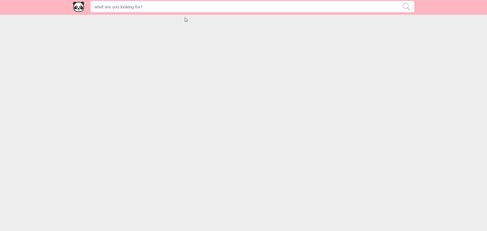

# search-mercadolibre
ADA ITW final project (React, Node.js)

El Trabajo Práctico consiste en una aplicación que consta de tres componentes principales:

- El cuadro de búsqueda
- El listado de los productos
- El detalle de un producto

La aplicación fue construida usando:

Cliente
 - HTML
 - JS (Utilizando React)
 - CSS (Utilizando SASS)
  
Servidor
 - Node
 - Express

